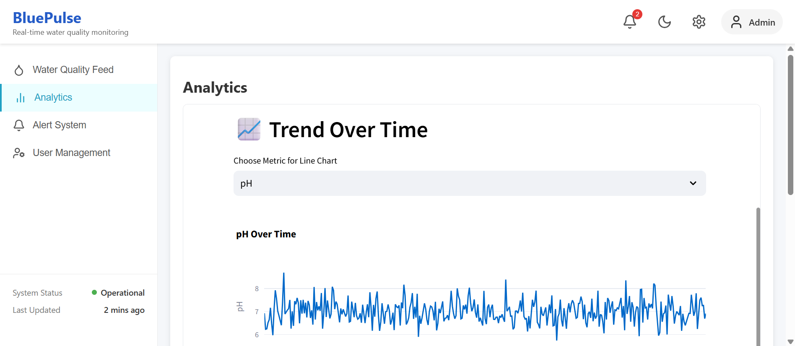
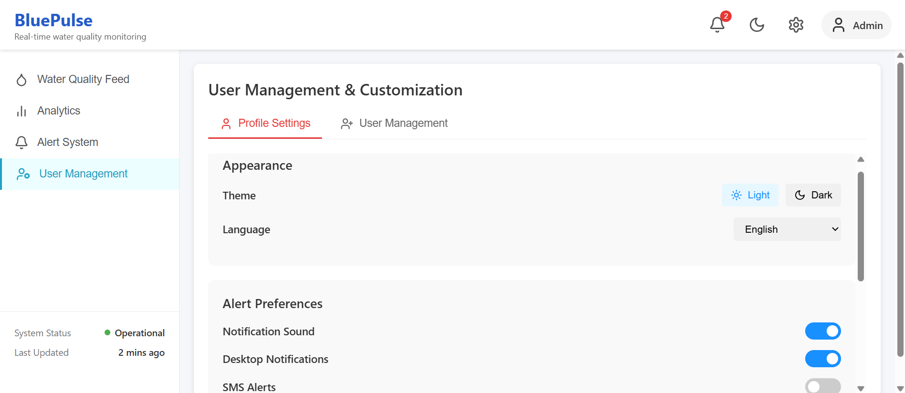

# 🌊 Disaster Track + Blue Pulse  
**Water Pollution Monitoring and Prediction System**

This project combines **Disaster Track** and **Blue Pulse** into a single platform for monitoring and predicting water pollution trends.  
The system provides a **Streamlit-based dashboard** for visualization, monitoring, and awareness, along with an **ARIMA forecasting model** for future water quality predictions.

---

## 🚀 Features
- 📊 **Interactive Dashboard** with Streamlit to track water quality metrics (pH, DO, Turbidity, Temperature).  
- 🗺 **Geospatial Visualization** using PyDeck to locate monitoring points.  
- 📈 **Trend Analysis & ETS Decomposition** to understand historical data patterns.  
- 🤖 **AI Insights & Chatbot** for environmental awareness and automated reporting.  
- 🔮 **ARIMA Forecasting Model** for 7-day water quality predictions.  
- 📱 **Twilio Alerts (Optional)** to send SMS notifications.  





---

## ⚙️ Setup Instructions

### 1️⃣ Clone the repository
```bash
git clone https://github.com/pranushha/Water-Pollution-Monitoring-.git

Running the Project

npm install 
npm start 

Run the Streamlit Dashboard

From the backend/ directory:
pip install streamlit-autorefresh

pip install cohere

streamlit run dashboard.py

Run the ARIMA Model Separately

From the backend/models/ directory:
python arima_model.py
